# **Traffic Sign Recognition** 

## Writeup
---

**Build a Traffic Sign Recognition Project**

## Step 1: Dataset Summary & Exploration

### Question 1 : Dataset Summary
Provide a Basic Summary of the Data Set Using Python, Numpy and/or Pandas
### Answer 
The size of the dataset and input images are:

Number of training examples = 34799
Number of testing examples = 12630
Image data shape = (32, 32)
Number of classes = 43

### Question 2 : Exploratory Visualization
The submission includes an exploratory visualization on the dataset.

### Answer : 
The number of images in each class is plotted below. At the end of notebook, the prediction accuracy of each class is tabulated.

Histogram:

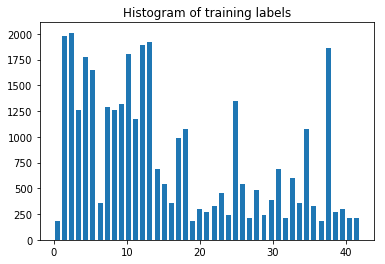

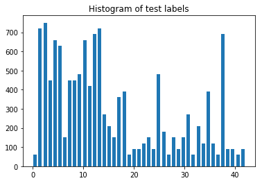

The dataset is not uniformly distributed. Label 19 has only 180 samples, which is small compared to maximum 2010 samples for label 2.

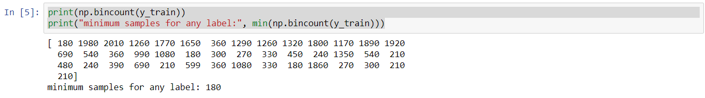

## Step 2: Design and Test a Model Architecture

### Question 3 : Preprocessing
The submission describes the preprocessing techniques used and why these techniques were chosen.

### Answer
I used the following preprocessing steps:
1. Grayscale conversion to simplify the dataset
2. Normalization of images to a value between -0.5 to 0.5
3. Since the dataset is in ordered sequence. I randomized the training dataset.
4. Adding 5 % gaussian noise to images to avoid overfitting

Grayscale Conversion:
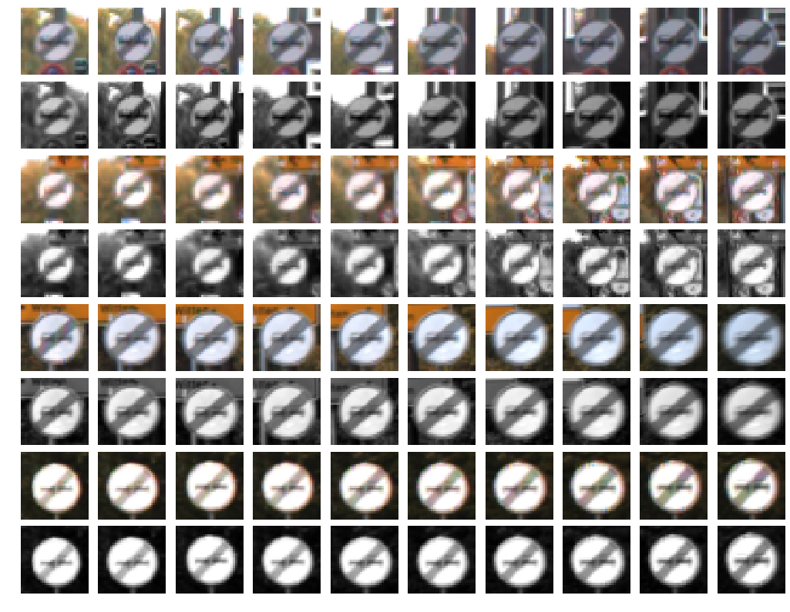

Normalization:
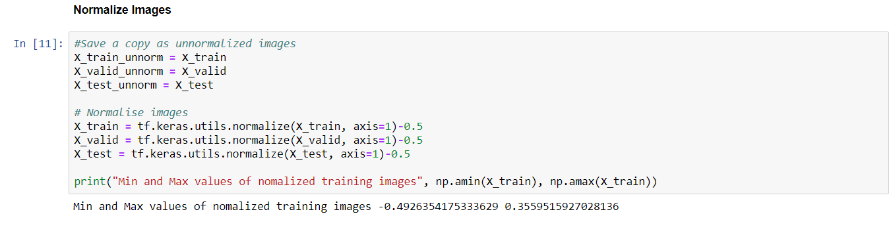

Randomizing dataset sequence:
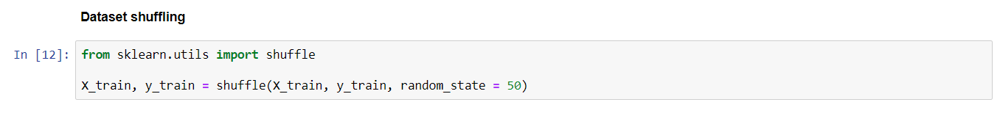

Adding noise:
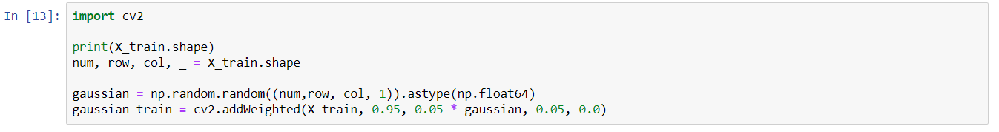

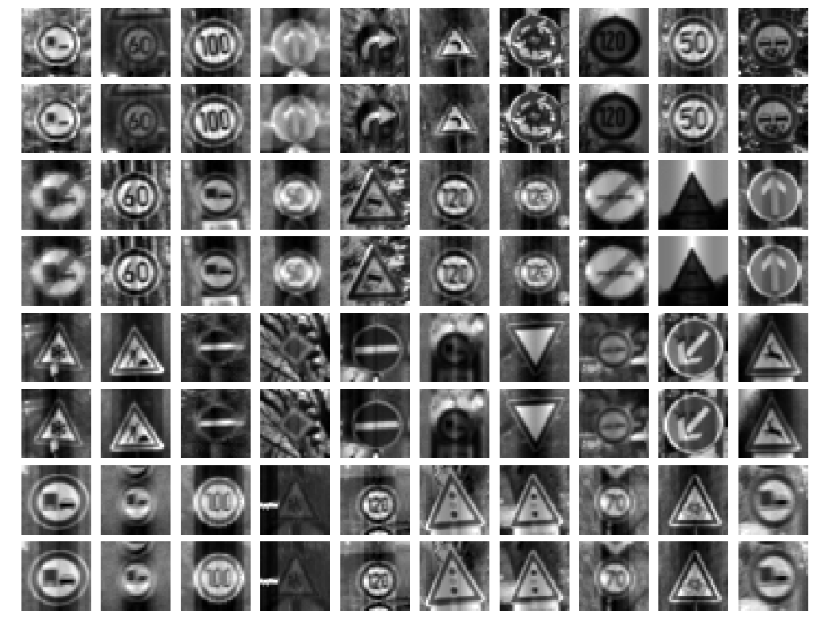

### Question 4 : Model Architecture 
The submission provides details of the characteristics and qualities of the architecture, including the type of model used, the number of layers, and the size of each layer. Visualizations emphasizing particular qualities of the architecture are encouraged.

### Answer: Using Sermanet/Lecunn paper
#### Sermanet/Lecunn reference architecture:
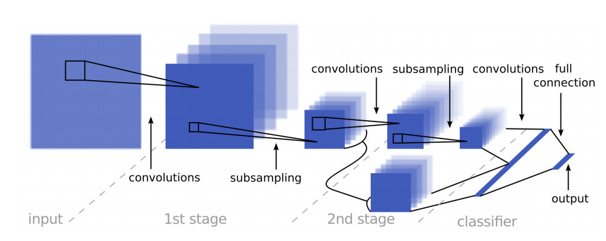
#### Tensorboard graph:
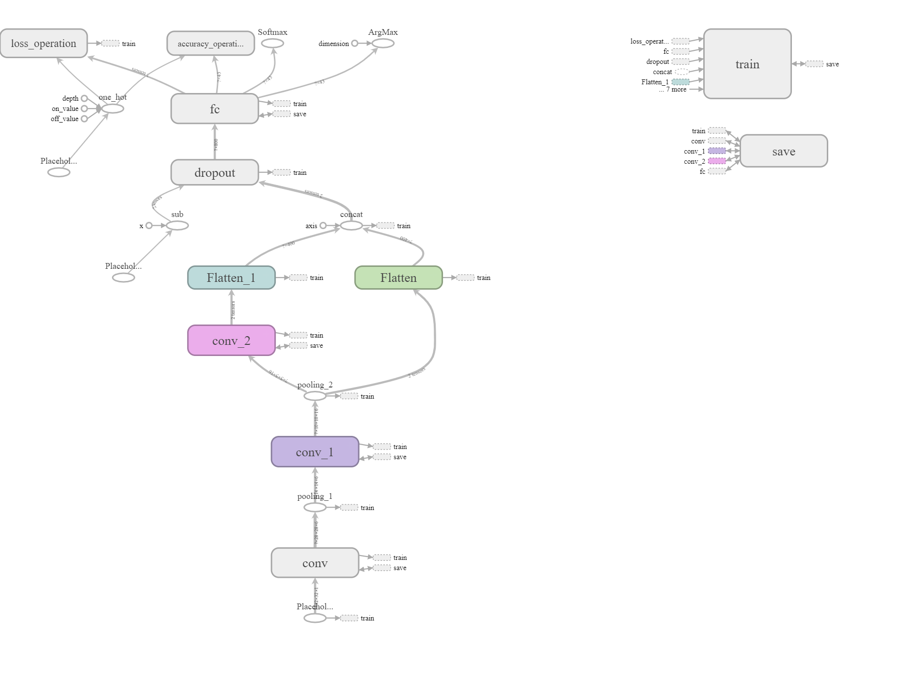

[Sermanet/Lecun](http://yann.lecun.com/exdb/publis/pdf/sermanet-ijcnn-11.pdf) neural network architecture yielded validation accuracy of around 94 % accuracy. The final solution was implemented using this architecture.

#### Input
The Netural Network architecture accepts a 32x32xC image as input, where C is the number of color channels. C is 3 in case of color images. C is 1 for grayscale images. I used grayscale images since color images did not perform better than grayscale images.

#### Architecture
**Layer 1: Convolutional 5x5.** The input is 32x32x1. The output shape should be 28x28x6.

**Activation.** RELU was used here.

**Pooling 2x2.** The output shape should be 14x14x6.

**Layer 2: Convolutional 5x5.** The input is 14x14x6. The output shape should be 10x10x16.

**Activation.** RELU was used here.

**Pooling 2x2.** The input is 10x10x16. The output shape should be 5x5x16.

**Layer 3: Convolutional 5x5.** The input is 5x5x6. The output shape should be 1x1x400.

**Activation.** RELU was used here.

**Flatten.** Flatten the output shape of layer 2 and 3 such that it's 1D instead of 3D. (2. 1x1x400 -> 400 and 3. 5x5x16 -> 400). 

**Concatenation.** Concatenate the two outputs together to get 800x1 output.

**Dropout Layer** Dropout was used here.

**Layer 3: Fully Connected (Logits).** This should have 800 inputs and 43 outputs.

#### Output
Return the result of the 2nd fully connected layer.

### Question 5 : Model Training
The submission describes how the model was trained by discussing what optimizer was used, batch size, number of epochs and values for hyperparameters.
### Answer
* Optimizer - Adam Optimizer
* Batch size - 128
* Epochs - 25
* learning rate - 0.001
* mu - 0
* sigma - 0.1
* dropout probability - 0.5

### Question 6 : Solution Approach
The submission describes the approach to finding a solution. Accuracy on the validation set is 0.93 or greater.

### Answer
I modified Lenet used for MNIST to classify the traffic sign images into 43 classes instead of 10 classes used in MNIST.
 Since it did not yield sufficient accuracy, I used Sermanet/Lenet architecture to train the neural network. This gave a 
 test accuracy of 92.3 % and validation accuracy of 95 %. Tensorboard was used to visualize the computation graph, 
 accuracy and losses. The training was terminated as soon as losses started increasing for the validation data to avoid 
 overfitting.
 
The model had the following accuracy and loss:

* Training Accuracy = 0.999
* Training Loss = 0.004
* Validation Accuracy = 0.953
* Validation Loss = 0.185
* Test Accuracy = 0.932
 
 **Chart of model accuracy and loss over several iterations of training:** 
 
 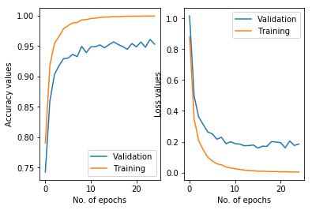
 
 
 ### Log
* 0.91 - Lenet, epoch=30
*
*
* 0.94, 0.92 - SermanetLeNet
* 0.934, 0.925, 0.92 -SermanetLeNet, sigma = 0.05, learning rate = 0.001
* 0.938 - SermanetLeNet, sigma = 0.05, learning rate = 0.001, epoch = 100
* 0.931, 0.936 - SermanetLeNet, sigma = 0.05, learning rate = 0.001, epoch = 100, adding noise to image
 
 **Testing data summary:**
 
        Class   precision    recall  f1-score   support

           0       0.92      0.75      0.83        60
           1       0.89      0.95      0.92       720
           2       0.91      0.97      0.94       750
           3       0.91      0.92      0.92       450
           4       0.96      0.93      0.94       660
           5       0.81      0.90      0.85       630
           6       0.97      0.77      0.86       150
           7       0.92      0.86      0.89       450
           8       0.91      0.93      0.92       450
           9       0.96      0.98      0.97       480
          10       0.98      0.98      0.98       660
          11       0.97      0.96      0.96       420
          12       0.98      0.99      0.98       690
          13       0.99      1.00      1.00       720
          14       0.95      0.96      0.96       270
          15       0.92      0.97      0.94       210
          16       0.99      0.99      0.99       150
          17       1.00      0.91      0.95       360
          18       0.92      0.82      0.87       390
          19       0.94      0.85      0.89        60
          20       0.76      0.93      0.84        90
          21       0.81      0.53      0.64        90
          22       0.91      0.91      0.91       120
          23       0.81      0.86      0.83       150
          24       0.74      0.67      0.70        90
          25       0.93      0.94      0.94       480
          26       0.87      0.82      0.85       180
          27       0.86      0.50      0.63        60
          28       0.93      0.93      0.93       150
          29       0.89      0.97      0.93        90
          30       0.72      0.76      0.74       150
          31       0.93      0.97      0.95       270
          32       0.97      0.98      0.98        60
          33       1.00      0.99      1.00       210
          34       0.97      0.97      0.97       120
          35       0.99      0.92      0.95       390
          36       0.97      0.97      0.97       120
          37       0.89      0.97      0.93        60
          38       0.96      0.97      0.96       690
          39       0.82      0.96      0.88        90
          40       0.91      0.66      0.76        90
          41       0.98      0.72      0.83        60
          42       0.93      0.97      0.95        90

   micro avg       0.93      0.93      0.93     12630
   macro avg       0.91      0.89      0.90     12630
weighted avg       0.93      0.93      0.93     12630
 
## Step 3: Test a Model on New Images

### Question 7 : Acquiring New Images
The submission includes five new German Traffic signs found on the web, and the images are visualized. 
Discussion is made as to particular qualities of the images or traffic signs in the images that are of interest, 
such as whether they would be difficult for the model to classify.

### Answer
5 images of german traffic signs were downloaded and cropped and resized to get 32x32 images. 
They were preprocessed using the same pipeline except random noise addition.

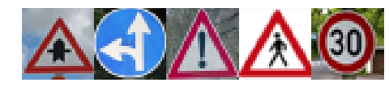

| Image			        |     Prediction	        					| 
|:---------------------:|:---------------------------------------------:| 
| Right-of-way at the next intersection | Right-of-way at the next intersection| 
| Go straight or left   | Go straight or left 	                        |
| General caution       | General caution                               |
| Pedestrians           | General caution                               |
| Speed limit (30km/h)  | Speed limit (30km/h)  				        |

### Question 8 : Performance on New Images
The submission documents the performance of the model when tested on the captured images. The performance on the new images is compared to the accuracy results of the test set.

### Answer
Since the acquired images were clear, unlike some of the test images which had saturation, occlusion problems, the accuracy was 80 %. Since there
were not many pedestrian images. The trained model was not able to accurately predict the traffic sign correctly but it 
chose a sign that close to that image.

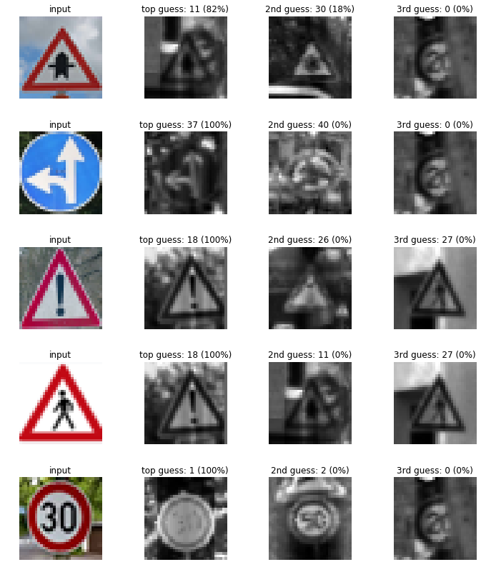

### Question 9 : Model Certainty - Softmax Probabilities
he top five softmax probabilities of the predictions on the captured images are outputted. The submission discusses how certain or uncertain the model is of its predictions.
### Answer
Since the acquired images were not tricky, the softmax probailities were around 100 % for all the images. 
The pedestrian traffic sign was not predicted correctly due to unavailability of data. 

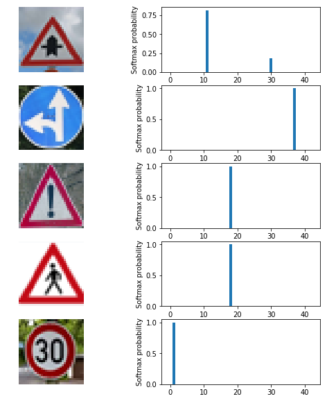

## Step 4 (Optional): Visualize the Neural Network's State with Test Images

To visualize the weights of the CNN layer, an image with high test confidence was tested.

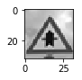

The results are shown below:

For Convolutional layer 1:

For Convolutional layer 2:
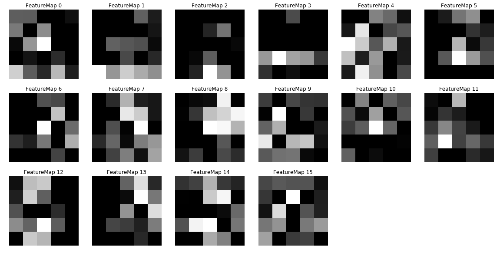

To visualize the weights of the CNN layer, an image with lower test accuracy was tested.

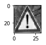

The results are shown below:

For Convolutional layer 1:

For Convolutional layer 2:
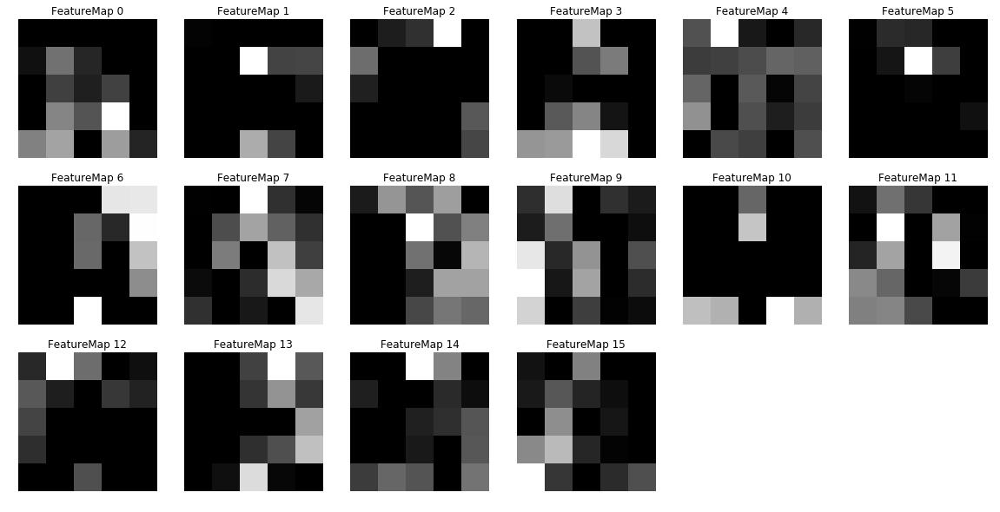